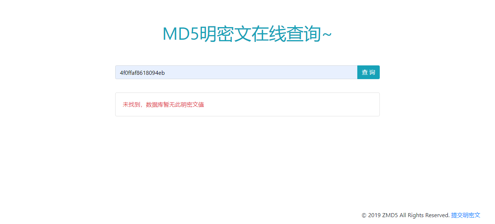
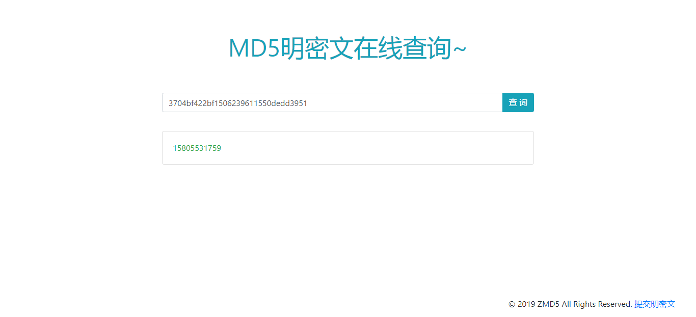
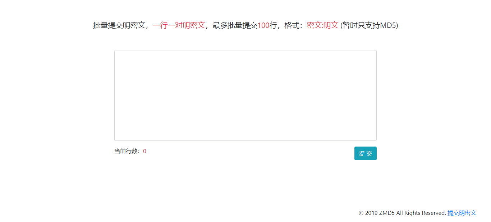

ZMD5查询MD5平台
MD5数据库索引平台
===============

基于ThinkPHP5+MongoDB数据库搭建

## 作者

作者博客：http://wileysec.com

作者Github主页：https://github.com/Wileysec

> ThinkPHP5的运行环境要求PHP5.6以上。

## MongoDB

需要在服务器或本机安装MongoDB数据库

安装完后，在windows下进入MongoDB程序的`bin`目录执行命令

~~~
mongod --dbpath=D:\mongoData\db
~~~

`--dbpath` 命令参数对应的是你存储MongoDB数据的目录

完成后即可启动MongoDB数据库服务

更多有关MongoDB配置知识请使用搜索引擎搜索获取

## 配置修改

将项目根目录的`.env`文件中的配置进行修改

`hostname` 一般填写127.0.0.1

`database` 为你的MongoDB数据库名称

`username` `password` 为MongoDB数据库用户名和密码，如没有设置则留空

`hostport` 为MongoDB端口号 默认端口27017

## 效果预览

